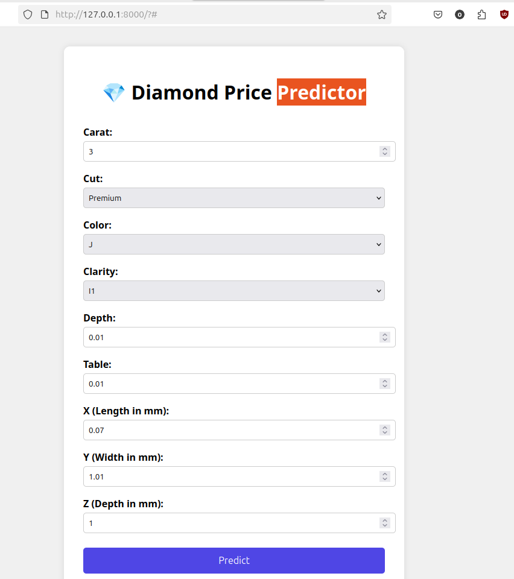
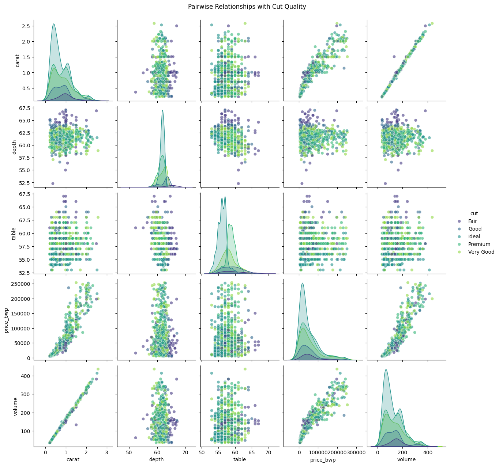

<div align="center">
<h1 style="display: flex; align-items: center; gap: 10px;">
  
  GemAI
</h1>
<p>An end-to-end solution for diamond price prediction using deep learning on tabular data.</p>

  
  
  
  
  
</div>


## 🔮 The Story Behind GemAI

I built GemAI out of pure curiosity, I wanted to play with Google's TabNet model and see how deep learning could handle structured tabular data (something we usually throw XGBoost at). Turns out, it's pretty good ...

*Why diamonds?* Well, they're kind of a big deal where I'm from - not just sparkly rocks but serious business. This project let me combine my interest in deep learning with something culturally relevant.

### The Jist

- **TabNet is powerful but quirky:** - The training process feels different from traditional models. You can't just throw your usual tricks at it and expect magic.
  
- **tuning:** - Finding the right hyperparameters was like trying to find the perfect diamond cut - lots of trial and error, but worth it when you get it right!

- **GPU Acceleartion:**  Night and day difference from CPU *chef's kiss*.

I'd say TabNet  is on par with good old traditional ML for this kind of data (eg.  XGBoost or Random Forests ...) It's another tool in the toolbox with its own strengths. I guess the real selling point is X-AI which i have to agree with the feature importance.




## Features

- **High Accuracy Predictions**: Trained on 50k+ diamond samples
- Automated tuning with Optuna
- **Low lantency Inference**: prediction latency
- **Interactive Web UI**
- **RESTful APIs** 
- **Production-ready API with FastAPI**

## 🧠 Tech Stack

| Component       | Technology                                                                 |
|-----------------|----------------------------------------------------------------------------|
| **Core Model**  |  [TabNet](https://github.com/dreamquark-ai/tabnet) |
| **Optimization**|  |
| **API**         |  |
| **Frontend**    |    |
| **Packaging**   |   |
| **Data Source** |  Diamonds Dataset |

## 📊 Exploratory Data Analysis

Comprehensive analysis of diamond features and their relationships:

[](./notebooks/EDA.ipynb)

*Click image to view full analysis notebook*

## ⚙️ Use:

*use uv preferably but pip still works*, [uv documentation](https://docs.astral.sh/uv/)

```bash
# Clone 
git clone https://github.com/yourusername/GemAI.git
cd GemAI

# in a  virtual environment
pip install uv 
uv install .
```

**Run  Server**
```bash
uvicorn app.main:app --reload
```
Visit `http://localhost:8000` in your browser

**API Request**
```bash
curl -X POST "http://localhost:8000/predict" \
-H "Content-Type: application/json" \
-d '{
    "carat": 0.75,
    "cut": "Ideal",
    "color": "D",
    "clarity": "IF",
    "depth": 62.1,
    "table": 57,
    "x": 5.71,
    "y": 5.73,
    "z": 3.55
}'
```
or use web GUI

## 📚 Documentation

### API Endpoints
| Endpoint       | Method | Description               | Request Body                                   |
|----------------|--------|---------------------------|-----------------------------------------------|
| `/predict`     | POST   | Get price prediction      | JSON with diamond features                    |
| `/`            | GET    | Web interface             | -                                             |
| `/docs`        | GET    | Interactive API docs      | -                                             |

### Input Parameters
```json
{
  "carat": 0.75,
  "cut": "Ideal",
  "color": "D",
  "clarity": "IF",
  "depth": 62.1,
  "table": 57,
  "x": 5.71,
  "y": 5.73,
  "z": 3.55
}

```

