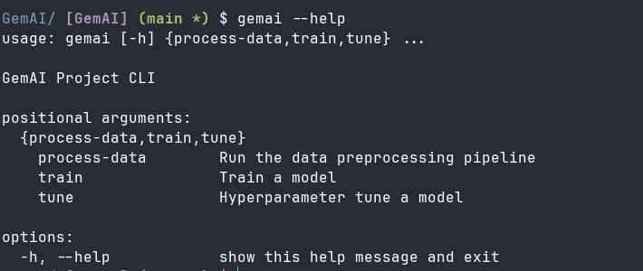
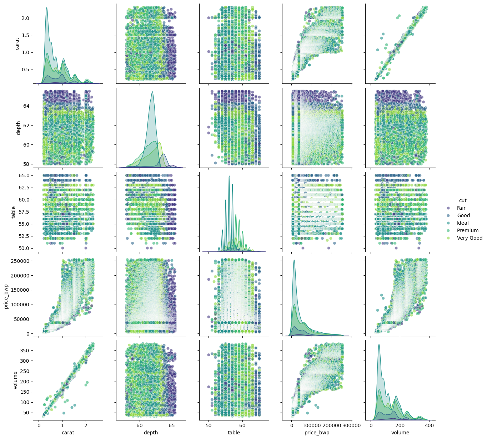
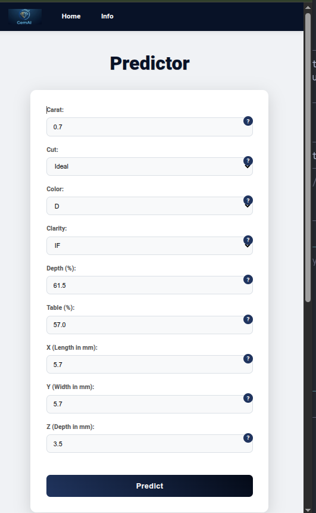
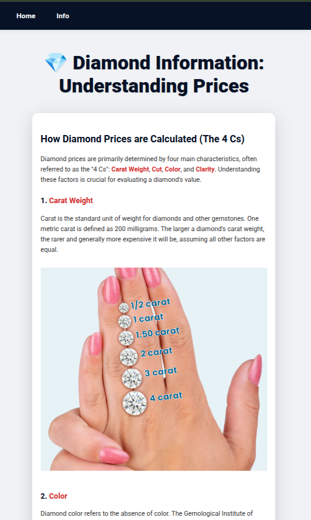

<div align="center">
<h1 style="display: flex; align-items: center; gap: 10px;">
  
</h1>
<h2>A Diamond Price Predictor</h2>
<p>An end-to-end solution for diamond price prediction using deep learning on tabular data, featuring a modern web interface and robust API.</p>

  
  
  
  
  
</div>

## 🔮 The Story Behind GemAI

I built GemAI out of pure curiosity, I wanted to play with Google's [TabNet](https://arxiv.org/pdf/1908.07442) model  and see how deep learning could handle structured tabular data (something we usually throw XGBoost at). Turns out, it's not too shaby... 

  I use [Autogluon](https://github.com/autogluon/autogluon?tab=readme-ov-file) as a benchmark for classical ML models because of its high accuracy and auto tuning. I wanted to compare the strongest classical models against Tabnet. Autogluon was developed by AWS AI to automates ML tasks, with just a few lines of code, you can train and deploy high-accuracy machine learning and deep learning models on image, text, time series, and tabular data.


*Why diamonds?* Well, they're kind of a big deal where I'm from - not just sparkly rocks but serious business. This project let me combine my interest in deep learning with something culturally relevant.

### The Jist

- **TabNet is powerful but quirky:** - The training process feels different from traditional models. You can't just throw your usual tricks at it and expect magic.
  
- **tuning:** - Finding the right hyperparameters was like trying to find the perfect diamond cut - lots of trial and error, but worth it when you get it right!

- **GPU Acceleartion:**  Night and day difference ...

I'd say TabNet  is a not as good as good-old traditional ML for this kind of task and data (eg.  XGBoost or Random Forests ...) It's another tool in the toolbox with its own strengths. I guess the real selling point is X-AI which i have to agree with the feature importance.


**Features**

- **High Accuracy Predictions**: Trained on 50K samples + Low latency Inference via fastapi API build.
- Automated hyperparameter tuning with Optuna.
- **Web UI**: Modern, responsive, and user-friendly interface for predictions.
- **Clear Feature Descriptions**: Tooltips provide detailed explanations for each input parameter.


## 🚀 Getting Started

Follow these steps to get GemAI up and running on your local machine.

### Prerequisites

This project uses `uv` for dependency management, which is a fast and modern Python package installer and resolver.

1.  **Install `uv`:**

    If you don't have `uv` installed, you can install it using `pip`:
    ```bash
    pip install uv
    ```
    For detailed installation instructions, refer to the [uv documentation](https://astral.sh/uv/tutorial/).

### Installation

1.  **Clone**
    ```bash
    git clone https://github.com/your-repo/GemAI.git
    cd GemAI
    ```

2.  **sync**

    `uv sync` will create a virtual environment and install all dependencies defined in `pyproject.toml`, including `gemai` in editable mode.
    ```bash
    uv sync
    source .venv/bin/activate 
    uv pip install -e . # add 'gemai" module
    ```

3.  **Verify `gemai` CLI:**

    You can now use the `gemai` command-line interface. Run `uv run gemai --help` to see available commands:
    ```bash
    uv run gemai --help
    ```
    This will output something similar to:

    

## Usage

### Data Preprocessing and EDA
Exploratory data analysis was done,you can look at [notebook](notebooks/EDA.ipynb). It details all cleaning steps and their justficiation and comprehensive data analysis, showing some correlation between variables and those  good stuff. The cleaned data is serialised under Data dir along with the dataset `diamonds.csv`. Look at `config.toml`   file data section. I have bundled all of this process into a python fuction that can be ran from cli with `gemai process-data` it will do the whole process of cleaning and searialising in the notebook.

```bash
uv run gemai process-data
```
This will generate `Data/clean_ds.plk`.


### 2. Model Training

Train the TabNet model. This will also generate the necessary `cat_mappings.pkl` file, crucial for inference.
```bash
uv run gemai train tabnet # or autogluon
```
*(This command might take some time to complete, depending on your system's performance.)*

### 3. Serving the Web Application

After preprocessing and training, you can serve the FastAPI web application.

  **Start the server**

  ```bash
  fastapi run app/main.py
  ```
  You should see output indicating that the Uvicorn server is running.

  Navigate to [http://0.0.0.0:8000](http://0.0.0.0:8000) in your web browser. You will see the interactive Diamond Price Predictor interface.

  <table>
  <tr>
    <td></td>
    <td></td>
  </tr>
  <tr>
    <td align="center">Predictor Interface</td>
    <td align="center">Info Panel</td>
  </tr>
</table>

### 4. Tuning (Optional)

To find optimal hyperparameters for the TabNet model:
```bash
gemai tune tabnet
```
*(This can be a time-consuming process. needs a gpu)*

## 📊  Results

### Classical Models

Results from Autogluon model training are in the [`leaderboard.csv`](Logs/Autogluon/leaderboard_parallel.csv) file, scored on rmse.


| Model                | Score Test | Score Val |   
|----------------------|------------|-----------|
| WeightedEnsemble_L2  | 6697.13    | 6280.38   |
| CatBoost             | 6758.99    | 6568.60   |
| LightGBMXT           | 6864.41    | 6506.51   |
| LightGBM             | 6893.93    | 6526.96   |
| LightGBMLarge        | 6956.74    | 6482.68   |
| ExtraTreesMSE        | 7005.29    | 6565.60   |
| XGBoost              | 7034.49    | 6549.60   |
| RandomForestMSE      | 7236.60    | 6716.59   |
| NeuralNetFastAI      | 7530.73    | 7239.99   |
| NeuralNetTorch       | 7685.42    | 7653.63   |


### TabNet Models
...

## 🧠 Tech Stack

| Component       | Technology                                                                 |
|-----------------|----------------------------------------------------------------------------|
| **Core Model**  |   <a href="https://github.com/autogluon/autogluon"> </a>[TabNet](https://github.com/dreamquark-ai/tabnet) |
| **Optimization**|  |
| **API**         |  |
| **Frontend**    |    |
| **Packaging**   |  |
| **Diamonds Dataset** |   |
